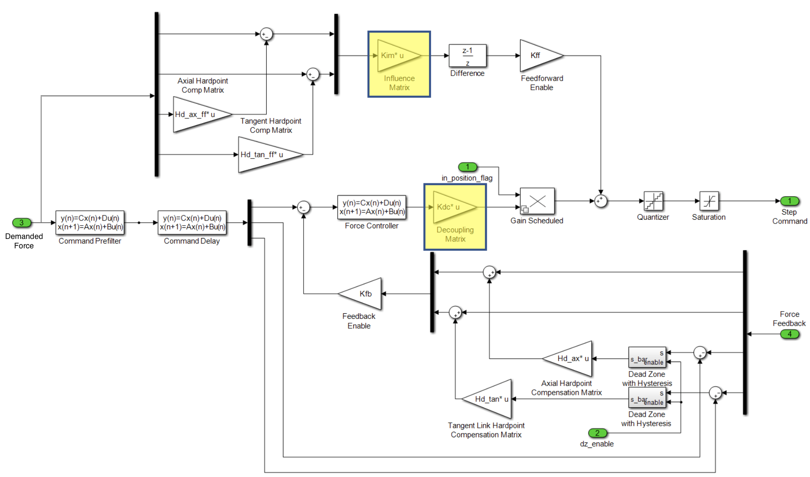

.. _Force_Control_Loop:

##################
Force Control Loop
##################

This document describes the force control loop in the M2 cell control system.
The goal is to calculate a step command record to 72 active stepper motors to produce the demanded force set given the load cell sensor feedback as well as input from temperature sensors while the M2 system experiences disturbances from the inertial loading and other environmental changes.
The details can follow the **T14900-0125, M2 Mirror Force Control Algorithm and Software Description Document**.

.. _force_control_loop_overview:

Overview
========

The block diagram of the M2 force control loop is shown in the following figure.
Based on the look-up table (LUT), the control system calculates the demanded forces of actuators.
The force error is defined to be the difference between the "filtered and delayed demanded force" and "feedbacked force".
The force controller calculates the additional force to apply based on the force error.
To minimize the error, overshoot, and settling time, the feedforward loop is introduced as well.

In each control cycle (20 Hz), the control system will restrict the actuator steps to move.
Therefore, the output of force controller will be quantized and saturated before moving the actuators.
The detailed implementation can follow the ``MockControlLoop.calc_actuator_steps()`` in `mock_control_loop.py <https://github.com/lsst-ts/ts_m2com/blob/develop/python/lsst/ts/m2com/mock/mock_control_loop.py>`_.

  Block diagram of the force control loop.

.. _force_control_loop_lut:

Look-Up Tables
==============

Various look-up tables (LUTs) exist in the M2 controller which generate the demanded actuator force given the cell sensor feedback (inclination and mirror temperature).
Since the LUT is based on the elevation angle of telescope mount assembly (TMA), a coordinate transformation will be required when using the internal inclination angle.
There are 12 temperature sensors attached to the back of the mirror that are used to determine the desired demanded force.
See the ``MockControlClosedLoop.calc_look_up_forces()`` in `mock_control_closed_loop.py <https://github.com/lsst-ts/ts_m2com/blob/develop/python/lsst/ts/m2com/mock/mock_control_closed_loop.py>`_ for the detailed calculation.

.. _force_control_loop_inclination_lut:

Inclination-based LUTs
----------------------

The LUT files that are inclination-based: elevation component (:math:`\vec{F}_{E}(\theta_{\text{lut}})`), 0g component (:math:`\vec{F}_{0}(\theta_{\text{lut}})`), actuator force bias (:math:`\vec{F}_{A}(\theta_{\text{lut}})`), and factory force offset (:math:`\vec{F}_{F}(\theta_{\text{lut}})`), where the LUT angle (:math:`\theta_{\text{lut}}`) has the same coordinate system as TMA.
Define the transformation between the internal inclination angle (:math:`\theta`) and LUT angle (:math:`\theta_{\text{lut}}`) to be: :math:`\theta_{\text{lut}} = g_{\text{trans}}(\theta)` (see the ``correct_inclinometer_angle()`` in `utility.py <https://github.com/lsst-ts/ts_m2com/blob/develop/python/lsst/ts/m2com/utility.py>`_), the gravity force correction, :math:`\vec{f}_{g}(\theta)`, can be calculated as the following:

.. math::
    \vec{f}_{g}(\theta) = \vec{F}_{E}(g_{\text{trans}}(\theta)) + \vec{F}_{0}(g_{\text{trans}}(\theta)) + \vec{F}_{A}(g_{\text{trans}}(\theta)) + \vec{F}_{F}(g_{\text{trans}}(\theta)).

See more LUT details in :ref:`Inclination_Based_LUTs` and the ``MockControlClosedLoop._calc_look_up_forces_gravity()`` in `mock_control_closed_loop.py <https://github.com/lsst-ts/ts_m2com/blob/develop/python/lsst/ts/m2com/mock/mock_control_closed_loop.py>`_ for the detailed calculation.

.. _force_control_loop_temperature_lut:

Temperature-based LUTs
----------------------

The temperature LUTs are essentially a vector of 72 scale factors that act up on the resulting sensed temperatures.
The temperature sensors are pre-conditioned to generate a value for uniform temperature distribution (:math:`\vec{T}_{u}`), radial temperature distribution (:math:`\vec{T}_{r}`), :math:`x`-axis temperature distribution (:math:`\vec{T}_{x}`) and :math:`y`-axis temperature distribution (:math:`\vec{T}_{y}`).
Assume the sensor reading is :math:`\vec{T}`, the referenced temperature is :math:`T_{\text{ref}}`, the angle of sensor is :math:`\vec{\theta}_{s}`, the distance between the sensor and cell's center is :math:`\vec{r}_{s}`, and its maximum is :math:`r_{s, \text{max}} = \max({\vec{r}_{s}})`.
We can calculate the temperature force correction, :math:`\vec{f}_{T}(\vec{T})`, as the following:

.. math::
    \vec{f}_{T}(\vec{T}) = (\vec{T}_{r}, \vec{T}_{x}, \vec{T}_{y}, \vec{T}_{u}) \times \left( \frac{\vec{r}_{s}}{r_{s, \text{max}}}, \frac{\vec{r}_{s}}{r_{s, \text{max}}}\cos({\vec{\theta}_{s}}), \frac{\vec{r}_{s}}{r_{s, \text{max}}}\sin({\vec{\theta}_{s}}) , 1 \right)^{-1} \times (\vec{T} - T_{\text{ref}})^{T}.

See the ``MockControlClosedLoop._calc_look_up_forces_temperature()`` in `mock_control_closed_loop.py <https://github.com/lsst-ts/ts_m2com/blob/develop/python/lsst/ts/m2com/mock/mock_control_closed_loop.py>`_ for the detailed calculation.

.. _force_control_loop_biquadratic_filter:

Biquadratic Filter
==================

The control algorithm is designed to accommodate configurable filters to enhance stability and protect against excitation of unwanted frequency injections.
Biquadratic filters were implemented with additional supplementary stages to accommodate any unforeseen changes in structural resonances or system growth.
The general form of :math:`n` biquadratic filters in :math:`z`-domain is:

.. math::
    H(z) = g \left(\frac{1 + b_{11}z^{-1} + b_{21}z^{-2}}{1 + a_{11}z^{-1} + a_{21}z^{-2}}\right) \left(\frac{1 + b_{12}z^{-1} + b_{22}z^{-2}}{1 + a_{12}z^{-1} + a_{22}z^{-2}}\right) \cdots \left(\frac{1 + b_{1n}z^{-1} + b_{2n}z^{-2}}{1 + a_{1n}z^{-1} + a_{2n}z^{-2}}\right),

where :math:`g` is the gain and :math:`a_{ij}` and :math:`b_{ij}` are constants.

See the ``BiquadraticFilter`` in `biquadratic_filter.py <https://github.com/lsst-ts/ts_m2com/blob/develop/python/lsst/ts/m2com/biquadratic_filter.py>`_ for the detailed implementation.
The related blocks are command pre-filtering and force controller.

.. _force_control_loop_cmd_prefilter_force_control:

Command Pre-Filtering and Force Controller
------------------------------------------

The command pre-filter and force controller are implemented as the eight-stage-cascaded biquadratic filters for axial and tangent actuators.
Both filters are intended to filter upstream signals to help restrict frequencies being introduced by the changing demanded force or feedback error.
The command pre-filter acts on a vector of 78 demanded forces while the force controller expects an input of 72 force errors of active actuators.
The related implementations are ``MockControlClosedLoop.calc_cmd_prefilter_params()`` and ``MockControlClosedLoop.calc_force_control_filter_params()`` in `mock_control_closed_loop.py <https://github.com/lsst-ts/ts_m2com/blob/develop/python/lsst/ts/m2com/mock/mock_control_closed_loop.py>`_.

.. _force_control_loop_cmd_delay_filter:

Command Delay Filter
--------------------

The command delay filter is intended to delay the demanded force to a value that is nearly identical to the delay expected from the hardware/plant and feedback.
A total of 6 coefficients are designed for use in the command delay filter (see the ``MockControlClosedLoop.calc_cmd_delay_filter_params()`` in `mock_control_closed_loop.py <https://github.com/lsst-ts/ts_m2com/blob/develop/python/lsst/ts/m2com/mock/mock_control_closed_loop.py>`_ and the ``SimpleDelayFilter`` in `simeple_delay_filter.py <https://github.com/lsst-ts/ts_m2com/blob/develop/python/lsst/ts/m2com/simple_delay_filter.py>`_):

.. math::
    H_{\text{delay}}(z) = b_{0} + b_{1} z^{-1} + b_{2} z^{-2} + ... + b_{5} z^{-5},

where :math:`b_{0 \ldots 5}` are constants.

Since the delay time is most generally not an integer number of control loop samples (0.05 seconds or 20 Hz), the command delay filter approximates a non-integer number of samples of delay.

The delay necessary was determined via the open-loop frequency response.
The slope of the phase response is indicative of the phase delay of system.
Matching the measured delay between the demand and response allows the feedforward to inject step commands respective to the latest demanded force while the feedback loop corrects disturbances and other errors.

.. _force_control_loop_feedforward_and_feedback:

Feedforward and Feedback
========================

To improve the stability and minimize the system noise, the feedback and feedforword loops are introduced.
In the feedback loop, the measured active actuator force with the hardpoint compensation is compared with the demanded actuator force to decide the force error.
The force controller calculates the expected force correction based on this force error.
To decrease the noise, the feedforward loop adds the hardpoint compensation to the control actuator steps after a time delay: :math:`1 - z^{-1}`, which equals to processing and plant delays to avoid false error computation.
See the ``MockControlLoop._calc_force_feedback()`` and ``MockControlLoop._calc_steps_feedforward()`` in `mock_control_loop.py <https://github.com/lsst-ts/ts_m2com/blob/develop/python/lsst/ts/m2com/mock/mock_control_loop.py>`_ for more details.

.. _force_control_loop_influence_decoupling_matrices:

Influence/Decoupling Matrices
=============================

System characterization and identification procedures can be referenced for an explanation of the experimental measurement of the influence and decoupling matrices.
They decouple each individual active actuator from the next.
The units of the elements of matrices are the motor steps per Newton.
The output of matrix multiplication is a series of the fractional units of steps, which represent the amount that each motor must move to achieve the desired force change indicated as the input.

Both of the matrices depend on the location of the hardpoints, and therefore, they must be recomputed or reconfigured when changing the set of hardpoints.
At the moment, both of matrixes are the same.
To derive the decoupling matrix (:math:`M_{\text{kdc}}`), we need to measure the stiffness matrix (:math:`M`) defined to be the actuator force changes with the active and hardpoint steps:

.. math::
    M =
    \begin{pmatrix}
    M_{a, a} & M_{a, hp} \\
    M_{hp, a} & M_{hp, hp}
    \end{pmatrix}.

Since only the active actuators can do the movement in steps (:math:`\Delta \vec{s}_{a}`), the related force changes are:

.. math::
    \begin{pmatrix}
    \Delta \vec{f}_{a} \\
    \Delta \vec{f}_{hp}
    \end{pmatrix}
    =
    \begin{pmatrix}
    M_{a, a} & M_{a, hp} \\
    M_{hp, a} & M_{hp, hp}
    \end{pmatrix}
    \begin{pmatrix}
    \Delta \vec{s}_{a} \\
    0
    \end{pmatrix}.

The feedbacked force is:

.. math::
    \Delta \vec{f}_{\text{feedback}} = \Delta \vec{f}_{a} - H_{\text{hp}} \Delta \vec{f}_{hp} = (M_{a, a} - H_{\text{hp}} M_{hp, a}) \Delta \vec{s}_{a},

where :math:`H_{\text{hp}}` is the hardpoint compensation matrix (see :ref:`Hardpoint_Compensation`) and the negaive sign comes from the fact that the hardpoints are the passive actuators.
Since :math:`\Delta \vec{s}_{a} = M_{\text{kdc}} \Delta \vec{f}_{\text{feedback}}`, we have:

.. math::
    M_{\text{kdc}} = (M_{a, a} - H_{\text{hp}} M_{hp, a})^{-1}.

See the ``MockControlClosedLoop.calc_kinetic_decoupling_matrix()`` in `mock_control_closed_loop.py <https://github.com/lsst-ts/ts_m2com/blob/develop/python/lsst/ts/m2com/mock/mock_control_closed_loop.py>`_ for the detailed calculation.

.. _force_control_loop_hardpoint_compensation_matrix:

Hardpoint Compensation Matrix
=============================

The hardpoint compensation matrix exists in the feedforward and feedback paths of the control loop.
It optimally transforms the errors measured on hardpoints to the active actuators to offset the resulting forces and moments.
It depends on the location of hardpoints, and therefore, it must be recomputed or reconfigured when changing the set of hardpoints.
The algorithm is formulated in :ref:`Hardpoint_Compensation`.
See the ``MockControlClosedLoop.calc_hp_comp_matrix()`` in `mock_control_closed_loop.py <https://github.com/lsst-ts/ts_m2com/blob/develop/python/lsst/ts/m2com/mock/mock_control_closed_loop.py>`_ for the related calculation.

.. _force_control_loop_nonlinear_controller_features:

Nonlinear Controller Features
=============================

The M2 controller possesses a pair of nonlinear features to improve settling performance and reduce excessive wear and slight mirror surface errors while imaging.
They are the gain scheduler and the hardpoint force compensation deadzone.

.. _force_control_loop_gain_scheduler:

Gain Scheduler
--------------

The control loop gain is scheduled based on the status of the in-position flag, which is decided according to the moving average of force error (see the ``MockInPosition`` in `mock_in_position.py <https://github.com/lsst-ts/ts_m2com/blob/develop/python/lsst/ts/m2com/mock/mock_in_position.py>`_).
When the mirror is in position, the system will transition to a low gain state to reduce the actuator stepping in response to noise.
The reduction in gain results in a lower bandwidth of the controller, which rejects the high frequency noise but also gives a slower response to external disturbances.
The detailed implementation can follow the ``MockGainSchedular`` in `mock_gain_schedular.py <https://github.com/lsst-ts/ts_m2com/blob/develop/python/lsst/ts/m2com/mock/mock_gain_schedular.py>`_.

.. _force_control_loop_hardpoint_deadzone:

Hardpoint Force Compensation Deadzone
-------------------------------------

This deadzone regulates the contribution of the hardpoint force compensation during times of slewing and imaging.
When enabled externally, the deadzone monitors the hardpoint force error.
The value is latched when the largest force error falls below the low threshold and the output remains constant until the largest force error exceeds the high threshold.
The detailed implementation can follow the ``MockDeadbandControl`` in `mock_deadband_control.py <https://github.com/lsst-ts/ts_m2com/blob/develop/python/lsst/ts/m2com/mock/mock_deadband_control.py>`_.

.. _force_control_loop_discontinuous_functions:

Discontinuous Functions
=======================

The M2 controller possesses discontinuous functions to limit step commands to match the capabilities of physical system in each control cycle.
The two discontinuous functions included in the controller are the quantizer and saturation blocks.
The quantizer block rounds the fractional step commands to integer step command values.
The saturation block limits the commanded step to the physically realizable step limit of stepper motors in each control cycle.
The related implementation can follow the ``MockControlLoop._saturate_actuator_steps()`` in `mock_control_loop.py <https://github.com/lsst-ts/ts_m2com/blob/develop/python/lsst/ts/m2com/mock/mock_control_loop.py>`_.

.. _force_control_loop_rigid_body_movement:

Rigid Body Movement
===================

The M2 control system follows the master-slave pattern in the rigid body movement.
The expected displacements of 78 actuators (:math:`\Delta \vec{d}`) are calculated based on the six degrees of freedom in 3D space: :math:`(\Delta x, \Delta y, \Delta z, \Delta r_{x}, \Delta r_{y}, \Delta r_{z})`.
The displacement :math:`\Delta \vec{d}` composes two parts: :math:`\Delta \vec{d}_{xyz}` and :math:`\Delta \vec{d}_{r_{xyz}}`.
The former comes from :math:`(\Delta x, \Delta y, \Delta z)` and the latter comes from :math:`(\Delta r_{x}, \Delta r_{y}, \Delta r_{z})`.

The axial component of :math:`\Delta \vec{d}_{xyz}` is :math:`\Delta \vec{d}_{xyz, a} = -\Delta z` because a positive axial displacement results in a negative change in piston.
The tangential component of :math:`\Delta \vec{d}_{xyz}` is :math:`\Delta \vec{d}_{xyz, t} = \Delta x \cos (\vec{\theta_{t}}) - \Delta y \sin (\vec{\theta_{t}})`, where :math:`\vec{\theta_{t}}` is the angle of tangent links.

Consider the axial component of :math:`\Delta \vec{d}_{r_{xyz}}`: :math:`\Delta \vec{d}_{r_{xyz}, a} = (\Delta d_{x, r_{xyz}, a}, \Delta d_{y, r_{xyy}, a}, \Delta d_{z, r_{xyz}, a})`, we have:

.. math::
    \begin{pmatrix}
    \Delta d_{x, r_{xyz}, a}\\
    \Delta d_{y, r_{xyz}, a}\\
    \Delta d_{z, r_{xyz}, a}
    \end{pmatrix} = R_{x}(\Delta r_{x}) R_{y}(\Delta r_{y}) R_{z}(\Delta r_{z})
    \begin{pmatrix}
    \vec{x}_{a}\\
    \vec{y}_{a}\\
    0
    \end{pmatrix},

where :math:`(\vec{x}_{a}, \vec{y}_{a}, 0)` is the position of axial actuators and :math:`R_{x,y,z}` is the rotation matrix.
Only the term of :math:`\Delta d_{z, r_{xyz}, a}` is controllable.
The tangential component of :math:`\Delta \vec{d}_{r_{xyz}}` is: :math:`\Delta \vec{d}_{r_{xyz, t}} = -r \sin(\Delta r_{z})`, where the negaive sign comes from the direction of coordinate system and :math:`r` is an average of 5 of 6 tangent location radius from the center of M2 cell.
See the detailed calculation in ``MockControlClosedLoop.rigid_body_to_actuator_displacement()`` of `mock_control_closed_loop.py <https://github.com/lsst-ts/ts_m2com/blob/develop/python/lsst/ts/m2com/mock/mock_control_closed_loop.py>`_.

The displacements will be divided to multiple small movements in each control cycle (see the ``MockModel.balance_forces_and_steps()`` in `mock_model.py <https://github.com/lsst-ts/ts_m2com/blob/develop/python/lsst/ts/m2com/mock/mock_model.py>`_).
Only the displacements of hardpoints are activily put into the control loop, and the displacements of active actuators will be decided with the minimum torsion at runtime.
See the ``MockControlClosedLoop.handle_forces()`` in `mock_control_closed_loop.py <https://github.com/lsst-ts/ts_m2com/blob/develop/python/lsst/ts/m2com/mock/mock_control_closed_loop.py>`_ for the details.

.. _force_control_loop_mirror_position:

Mirror's Position
=================

.. _force_control_loop_measurement_hardpoints:

Measurement from the Hardpoints
-------------------------------

The M2 position :math:`(x, y, z, r_{x}, r_{y}, r_{z})` can be decided based on the hardpoint positions.
This is a reversed calculation of :ref:`force_control_loop_rigid_body_movement` with the best-fitting rigid transformation (see the `Least-Squares Rigid Motion Using SVD <https://igl.ethz.ch/projects/ARAP/svd_rot.pdf>`_ for the details).

The position :math:`(z, r_{x}, r_{y})` can be determined according to the displacement of axial hardpoints (:math:`\Delta \vec{d}_{h, a}`) from home position as the following:

.. math::
    \begin{pmatrix}
    \cos(\frac{\pi}{2} - r_{y}) \\
    -\sin(r_{x}) \\
    -z
    \end{pmatrix} =
    (\vec{x}_{h, a}, \vec{y}_{h, a}, 1)^{-1}\Delta \vec{d}_{h, a},

where :math:`(\vec{x}_{h, a}, \vec{y}_{h, a})` are the positions of axial hardpoints.

To determine :math:`(x, y)`, define :math:`\vec{\theta}_{t, c}` and :math:`\vec{\theta}_{t, h}` to be the angle of tangent links at current and home positions, we have:

.. math::
    \vec{\theta}_{t, c} = \vec{\theta}_{t, h} + \tan^{-1}(\vec{d}_{t} / R),

where :math:`\vec{d}_{t}` is the displacement of tangent links and :math:`R` is the distance between the tangent links and cell's center.
The current position of tangential hardpoints is:

.. math::
    \begin{aligned}
    \vec{x}_{h, t, c} &= R \cos(\pi/2 - \vec{\theta}_{t, c}) \\
    \vec{y}_{h, t, c} &= R \sin(\pi/2 - \vec{\theta}_{t, c}).
    \end{aligned}

And the position :math:`(x, y)` is:

.. math::
    \begin{aligned}
    x &= 2 (\bar{x}_{h, t, c} -  \bar{x}_{h, t, h}) \\
    y &= 2 (\bar{y}_{h, t, c} - \bar{y}_{h, t, h}),
    \end{aligned}

where :math:`\bar{x}_{h, t, c}` is the average of current :math:`\vec{x}_{h, t, c}`, :math:`\bar{y}_{h, t, c}` is the average of current :math:`\vec{y}_{h, t, c}`, :math:`\bar{x}_{h, t, h}` is the average of home :math:`\vec{x}_{h, t, h}`, and :math:`\bar{y}_{h, t, h}` is the average of home :math:`\vec{y}_{h, t, h}`.

To calcualte :math:`r_{z}`, follow the `Least-Squares Rigid Motion Using SVD <https://igl.ethz.ch/projects/ARAP/svd_rot.pdf>`_ to do the singular value decomposition (SVD) for the following matrix to get :math:`U` and :math:`V`:

.. math::
    (\vec{x}_{h, t, h} -  \bar{x}_{h, t, h}, \vec{y}_{h, t, h} -  \bar{y}_{h, t, h})^{T}(\vec{x}_{h, t, c} -  \bar{x}_{h, t, c}, \vec{y}_{h, t, c} -  \bar{y}_{h, t, c}).

Then, we can get :math:`r_{z}` from the rotation matrix:

.. math::
    R_{z}(r_{z}) = V \det
    \begin{pmatrix}
    1 & 0 \\
    0 & VU^{T}
    \end{pmatrix}
    U^{T}.

See the ``MockControlClosedLoop.hardpoint_to_rigid_body()`` in `mock_control_closed_loop.py <https://github.com/lsst-ts/ts_m2com/blob/develop/python/lsst/ts/m2com/mock/mock_control_closed_loop.py>`_ for the detailed calculation.

.. _force_control_loop_measurement_ims:

Measurement from the Independent Measurement System
---------------------------------------------------

The M2 mirror has 6 sensors of the independent measurement system (IMS) that can be used to decide the mirror's position.
The detail can follow the :ref:`Calculating_Position_IMS`.
