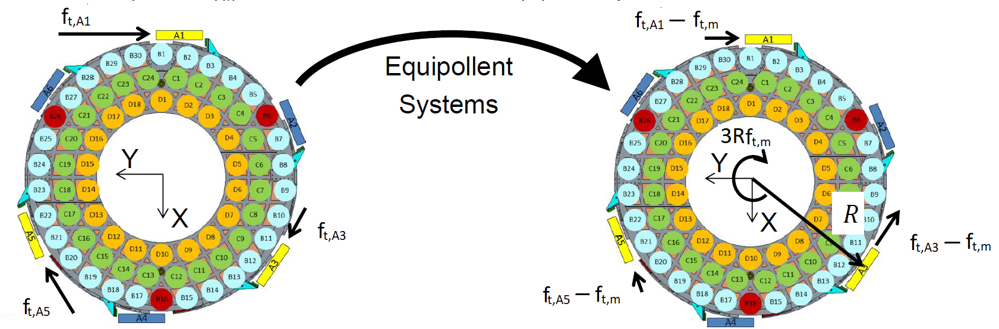

.. _Hardpoint_Compensation:

######################
Hardpoint Compensation
######################

Three axial and three tangential actuators are selected to be the passive hardpoints.
They serve as the rigid body restraints in tip, tilt, and piston for the mirror's movement.
Therefore, the force compensation is required to avoid discontinuous forces at the hardpoints.
To minimize the stress, the selection of hardpoints should be symmetric to be closed to the equilateral triangle (see the ``check_hardpoints()`` in `utility.py <https://github.com/lsst-ts/ts_m2com/blob/develop/python/lsst/ts/m2com/utility.py>`_).

.. _hardpoint_compensation_axial_hardpoints:

Axial Hardpoints
================

Define the axial hardpoint force error for link :math:`i` as the following:

.. math::
    f_{a, e_{i}} = f_{a, r_{i}} - f_{a, m_{i}} \ \ \ i=1,2,3

where :math:`f_{a, r_{i}}` is the referenced force and :math:`f_{a, m_{i}}` is the measured force for axial hardpoints.
Approximate the dependency between :math:`f_{a, e_{i}}` and position :math:`(x_{h, i}, y_{h, i})` to be :math:`f_{a, e_{i}} = a x_{h, i} + b y_{h, i} + c`, where :math:`a`, :math:`b`, and :math:`c` are the constants.
We can solve :math:`(a, b, c)` to be:

.. math::
    \begin{pmatrix}
    a\\
    b\\
    c
    \end{pmatrix} =
    \begin{pmatrix}
    x_{h, 1} & y_{h, 1} & 1 \\
    x_{h, 2} & y_{h, 2} & 1 \\
    x_{h, 3} & y_{h, 3} & 1
    \end{pmatrix}^{-1}
    \begin{pmatrix}
    f_{a, e_{1}}\\
    f_{a, e_{2}}\\
    f_{a, e_{3}}
    \end{pmatrix}.

Define :math:`f_{a, c_{j=1 \ldots 69}}` to be 69 actively controlled actuator compensation forces and the related position is :math:`(x_{c, j}, y_{c, j})`.
We have:

.. math::
    \begin{pmatrix}
    f_{a, c_{1}}\\
    f_{a, c_{2}}\\
    \vdots \\
    f_{a, c_{69}}
    \end{pmatrix} =
    \begin{pmatrix}
    x_{c, 1} & y_{c, 1} & 1 \\
    x_{c, 2} & y_{c, 2} & 1 \\
    \vdots & \vdots & \vdots \\
    x_{c, 69} & y_{c, 69} & 1
    \end{pmatrix}
    \begin{pmatrix}
    a\\
    b\\
    c
    \end{pmatrix} =
    \begin{pmatrix}
    x_{c, 1} & y_{c, 1} & 1 \\
    x_{c, 2} & y_{c, 2} & 1 \\
    \vdots & \vdots & \vdots \\
    x_{c, 69} & y_{c, 69} & 1
    \end{pmatrix}
    \begin{pmatrix}
    x_{h, 1} & y_{h, 1} & 1 \\
    x_{h, 2} & y_{h, 2} & 1 \\
    x_{h, 3} & y_{h, 3} & 1
    \end{pmatrix}^{-1}
    \begin{pmatrix}
    f_{a, e_{1}}\\
    f_{a, e_{2}}\\
    f_{a, e_{3}}
    \end{pmatrix}.

The hardpoint compensation matrix (:math:`H_{\text{hp}, \text{axial}}`) for axial actuators is defined to be:

.. math::
    H_{\text{hp}, \text{axial}} =
    \begin{pmatrix}
    x_{c, 1} & y_{c, 1} & 1 \\
    x_{c, 2} & y_{c, 2} & 1 \\
    \vdots & \vdots & \vdots \\
    x_{c, 69} & y_{c, 69} & 1
    \end{pmatrix}
    \begin{pmatrix}
    x_{h, 1} & y_{h, 1} & 1 \\
    x_{h, 2} & y_{h, 2} & 1 \\
    x_{h, 3} & y_{h, 3} & 1
    \end{pmatrix}^{-1}.

This is a constant matrix that depends only on the locations of the hardpoints and active actuators.
The moments :math:`x` and :math:`y` keep the same when distributes the force of hardpoints to other active actuators.

.. _hardpoint_compensation_tangential_hardpoints:

Tangential Hardpoints
=====================

The tangential hardpoints can only be (A1, A3, A5) or (A2, A4, A6) based on the symmetry.
Assume the hardpoints are (A1, A3, A5) and the related force are :math:`f_{t, i}, i \in \{A1, A3, A5\}`.
The mean force is :math:`f_{t, m} = (f_{t, A1} + f_{t, A3} + f_{t, A5})/3`, and generates a restraint moment about :math:`z`-axis to be :math:`3 R f_{t, m}`, where :math:`R` is the distance between the tangent link and cell's center.
This equals to a system that has the force, :math:`f_{t, i} - f_{t, m}`, on (A1, A3, A5) with a moment `z`, :math:`3 R f_{t, m}` as shown in the following figure:

  Equipollent system of the tangent links.

For the active tagent links (A2, A4, A5) to maintain this :math:`z`-moment while keeping the hardpoints to be passive, we need:

.. math::
    \begin{aligned}
    f_{t, A2} &= -(f_{t, A5} - f_{t, m}) + f_{t, m} = 2 f_{t, m} - f_{t, A5} \\
    &= \frac{2}{3} (f_{t, A1} + f_{t, A3} + f_{t, A5}) - f_{t, A5} \\
    f_{t, A4} &= -(f_{t, A1} - f_{t, m}) + f_{t, m} = 2 f_{t, m} - f_{t, A1} \\
    &= \frac{2}{3} (f_{t, A1} + f_{t, A3} + f_{t, A5}) - f_{t, A1} \\
    f_{t, A6} &= -(f_{t, A3} - f_{t, m}) + f_{t, m} = 2 f_{t, m} - f_{t, A3} \\
    &= \frac{2}{3} (f_{t, A1} + f_{t, A3} + f_{t, A5}) - f_{t, A3}
    \end{aligned}

or

.. math::
    \begin{pmatrix}
    f_{t, A2}\\ 
    f_{t, A4}\\ 
    f_{t, A6}
    \end{pmatrix} = \frac{1}{3}
    \begin{pmatrix}
    2 & 2 & -1\\ 
    -1 & 2 & 2\\ 
    2 & -1  & 2 
    \end{pmatrix}
    \begin{pmatrix}
    f_{t, A1}\\ 
    f_{t, A3}\\ 
    f_{t, A5}
    \end{pmatrix}
    = H_{\text{hp}, \text{tangent}}
    \begin{pmatrix}
    f_{t, A1}\\ 
    f_{t, A3}\\ 
    f_{t, A5}
    \end{pmatrix},

where :math:`H_{\text{hp}, \text{tangent}}` is the hardpoint compensation matrix for tangential actuators.
