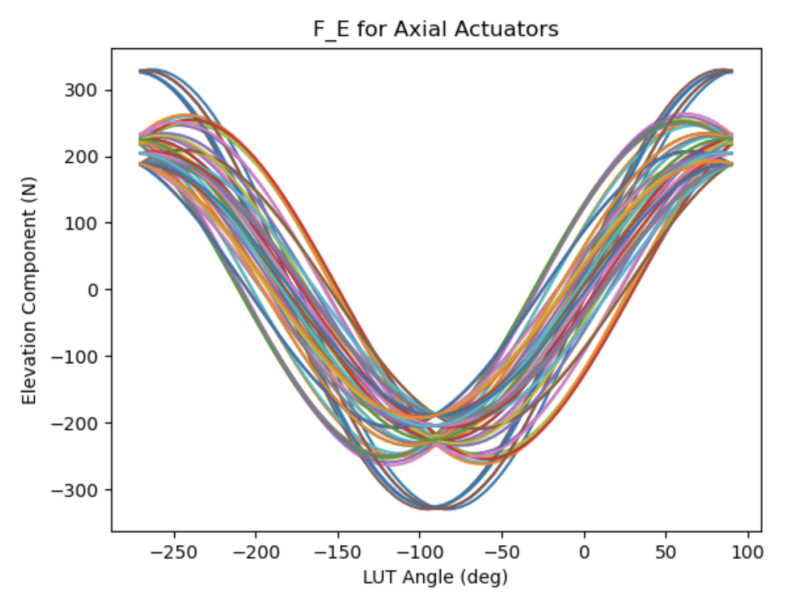
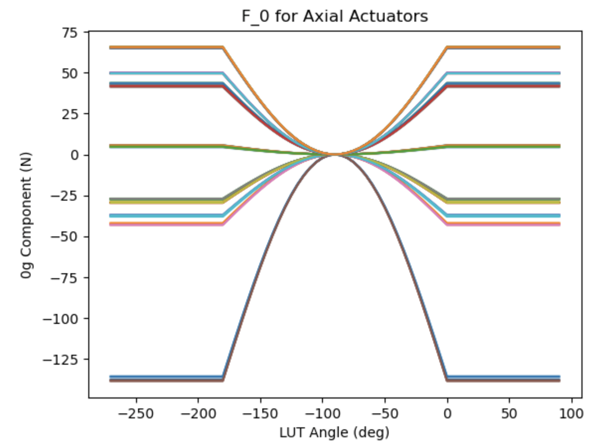
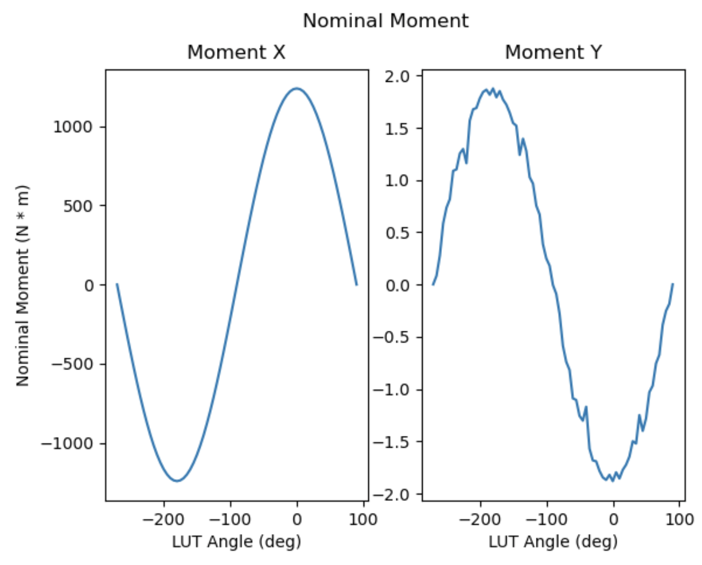
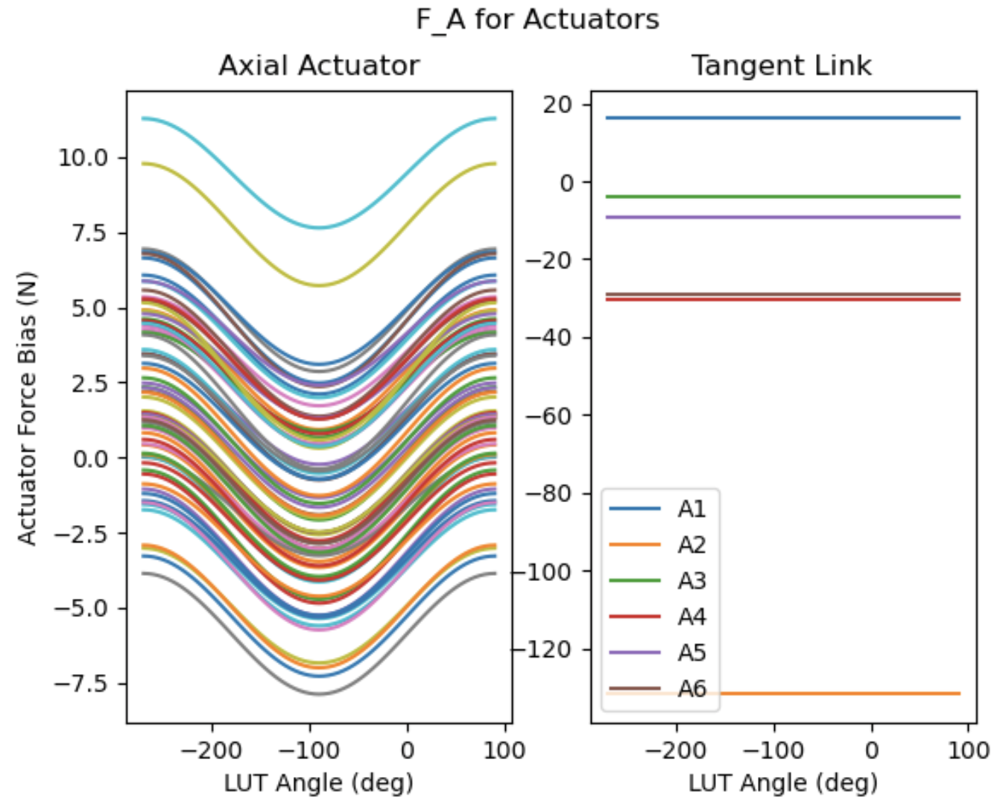
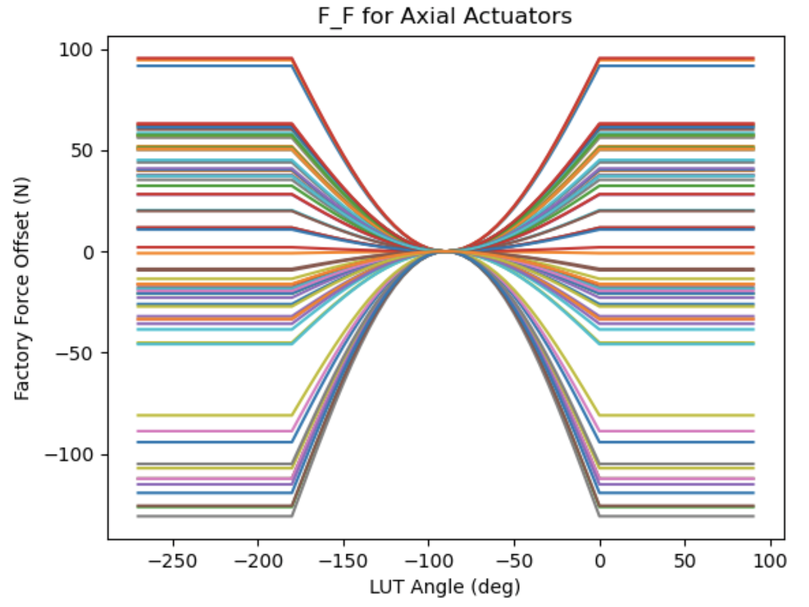
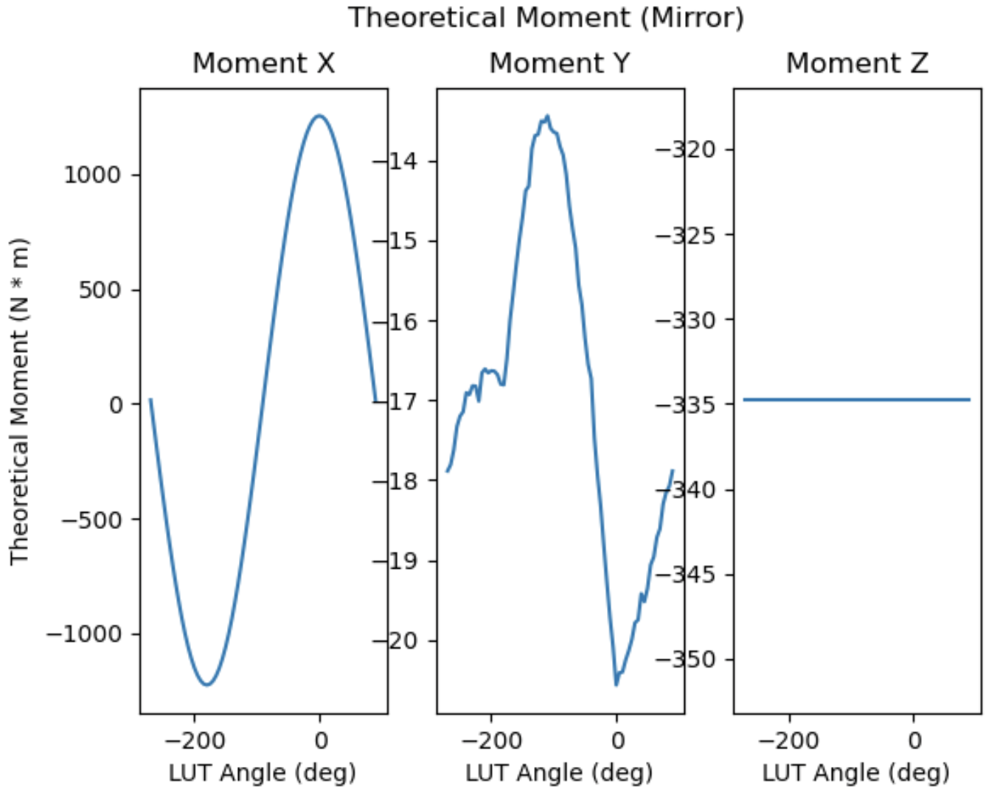

.. _Inclination_Based_LUTs:

######################
Inclination-Based LUTs
######################

There are 4 components for gravity corrections:

1. **F_E**: Force for the elevation component of command in Newton.
2. **F_0**: Force for the 0g component of command in Newton.
3. **F_A**: Force for the actuator force bias in Newton.
4. **F_F**: Force for the factory force offset in Newton.

All components are independent with each other.
Between the surrogate and mirror, the only difference of inclination-based LUTs is **F_F**.
For the surrogate, all values in **F_F** LUT are 0.

.. _lut_gravity_elevation_component:

Elevation Component
===================

**F_E** is interpolated from the stored LUT:

1. Linear interpolation between closest two elevations in table.
2. Without **F_0**, **F_E** is the bare elevation LUT equal to the minimum strain forces.
3. Nominally, 5 degree increments from 90 (zenith) to -265 degrees. 90-0 is telescope operating range. 0-(-265) is for cart turnove0-(-265) is for cart turnover.

Based on the document: **LSST M2 Correctability Analysis, May 19, 2016**, two LUT interpolation approaches were already investigated:

1. Polynomial curve fitting to generate a function of elevation angle.
2. Linear interpolation.

Both methods generated similar force error (relative to a smoothed curve) on the order of 0.1 pounds for 5 degree table increment.
Error is less than the load cell accuracy requirement of +/-0.225 pounds.
Polynomial curve fitting would significantly increase the complexity of LUT updating.
Therefore, the elevation-dependent forces will be calculated by linear interpolation because it is accurate and simple in the LabVIEW cell control system.

  Demonstration of the **F_E** LUT.

.. _lut_gravity_0g_component:

0g Component
============

**F_0** is a correction of error in the 0g shape of the mirror:

1. It is the difference between the minimum strain force set and the nominal force set.
2. Needs to be turned off for cart turnover.

   - 0g forces need to be removed for turnover (negative weight + negative static correction :math:`\rightarrow` high force magnitude).
   - If simply switched off at horizon, actuator force would be discontinuous.
   - Will be sinusoidally scaled to zero at nadir.
   - For uniformity of control, interpolated from a table as are elevation components. Constant 90 to 0 and -180 to -265.

3. Separated from **F_E** to facilitate the LUT updating (it may be of practical value to approximate the 0g shape of M2 in use).

0g forces are gradually reduced to 0 for cart turnover to create continuous force profile and low-stress mirror support.

.. note::
    The update of LUT should be on the tables: **F_E** and **F_0**.

  Demonstration of the **F_0** LUT.

.. _lut_gravity_nominal_zenith_forces:

Nominal Zenith Forces
=====================

Nominal zenith forces are the sum of the bare LUT value and the 0g correction forces.
This is based on the finite element analysis (FEA) to minize the strain of mirror.
Under the current scheme (or design), the single actuator of the inner ring (D ring) supports more weight compared with the actuator of the outer ring (ring B).

.. _lut_gravity_theoretical_moment_xy:

Theoretical Moment X, Y based on the Nominal Forces
---------------------------------------------------

This gives the ideal net moment x and y of M2.
For the six tangent links (A1 - A6), only A2, A3, A5, and A6 will support the mirror's weight.
The force's direction of A2 and A3 is reversed to A5 and A6.
Therefore, the calculation of moment z should be 0 under the ideal orientation and assembly.

  Nominal moment x and y.

In the above figure, we can see when the LUT angle is 0 degree, the moment-x is around 1238.28 N.
This balances with the moment from the mirror's weight with position of central gravity: 1588.65 kg * 9.8 m/s^2 * 3.1944 inch * 0.0254 m = 1263.22 N.

.. note::
   1. The value of 1588.65 kg comes from one of vendor's document.
   2. The value of 3.1944 inch comes from the `TangentTargetOffload.m <https://github.com/lsst-ts/ts_mtm2_matlab_tools/blob/develop/Tools/TangentTargetOffload.m>`_.

.. _lut_gravity_actuator_force_bias:

Actuator Force Bias
===================

**F_A** is established at the factory:

1. Corrects for self-weight readings of load cell (which change with elevation for the axial actuators).
2. Will be measured as part of the actuator setup.

.. note::
   If any actuator on M2 is replaced by a spare actuator, this table needs to be updated to reflect the change of actuator.

  Demonstration of the **F_A** LUT.

.. _lut_gravity_factory_offset:

Factory Offset of Mirror
========================

**F_F** is correction of residual fabrication error:

1. Like 0g error, this is a static term that is constant with elevation.
2. Different from 0g error in intent; 0g error is meant to exist, factory error is not.
3. Like 0g error, it must be gradually turned off as the mirror is inverted. Also interpolated from a table.

  Demonstration of the **F_F** LUT.

.. _lut_gravity_theoretical_moment_lut:

Theoretical Moment for the Mirror's LUT
=======================================

Calculate the theoretical moment based on LUT of mirror.
The measured value should be closed to this theoretical limits if:

1. M2 has the ideal orientation and assembly.
2. Force balance system (FBS) works well.

In the following simulation, we can see:

1. At the horizon, the moment x has the value of 1253.86 N * m, which is closed to the 1263.22 N * m calculated above.
2. The moment z is a constant.

  Theoretical moments.
