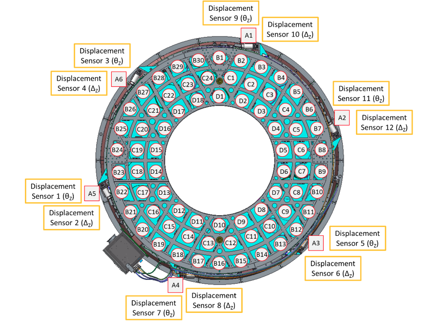
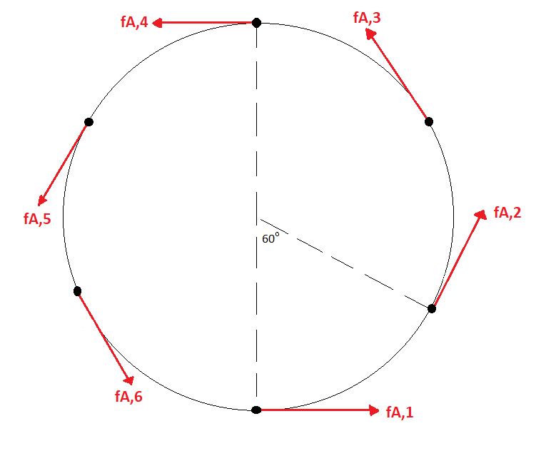
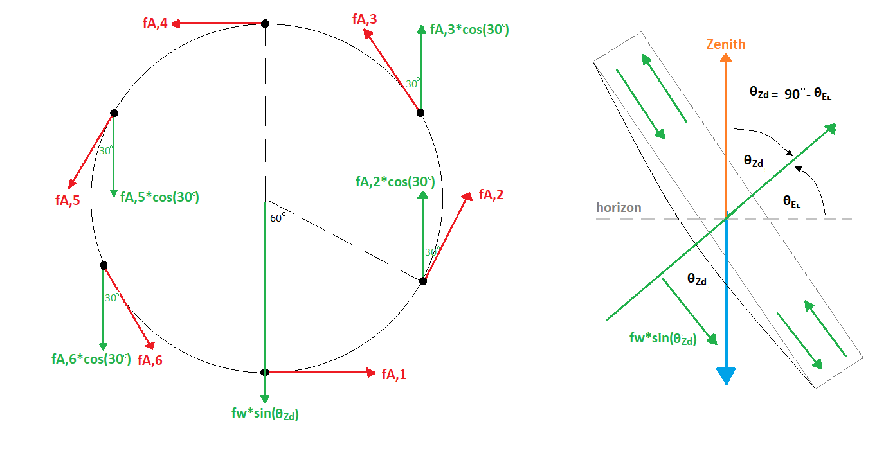
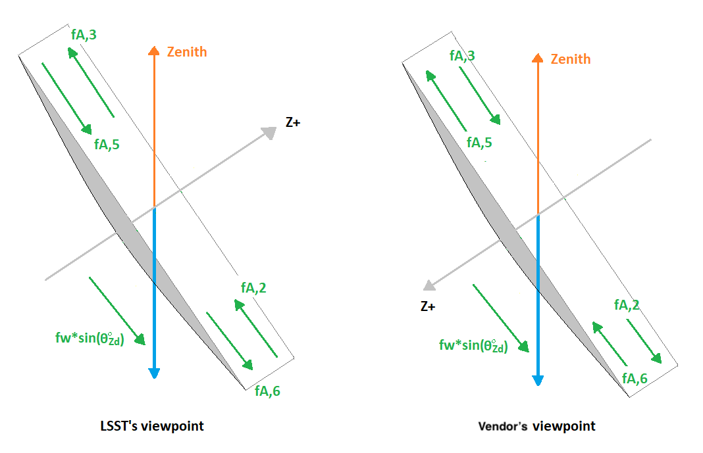

.. _Tangent_Load_Cell_Fault_Detection:

#################################
Tangent Load Cell Fault Detection
#################################

.. _tan_fault_det_overview:

Overview
========

This document explains the calculation to determine the mirror's safety that relates to the trangential links.

.. _tan_fault_det_tan_links:

Tangential Links
================

The M2 is an active mirror with 72 axial actuators and 6 tangential links.
The following figure shows the 6 tangential links located at A ring and labeled with A1-A6.

  Axial and tangential actuators labeled on cell.

.. _tan_fault_det_tan_forces:

Tangential Forces
=================

The tangential force, :math:`\vec{f}_\text{tan}`, is defined as the following:

.. math::

    \vec{f}_{\text{tan}} = (f_{A, 1 \dotsc 6})

The following figure shows the orientation of tangential forces on M2 mirror:

  Tangential forces on the M2 mirror.

.. _tan_fault_det_fault_monitoring:

Tangential Load Fault Monitoring
================================

To protect the mirror, it is necessary to determine if the mirror is tending to be under an unsafe condition or not.
When the mirror is on the tilt orientation, the tangential forces have to compensate the gravity force of mirror (:math:`f_{w}sin(\theta_\text{Zd})`) as the following figure:

  Tangential force components and gravity force on the mirror pointing to horizon with :math:`\theta_\text{EL}`. :math:`f_{w}` is the mirror weight (:math:`m_{\text{mirror}}`) in kg times the gravity acceleration (:math:`g`).

To compensate the gravity force, the following condition needs to be fulfilled:

.. math::

    -f_{A, 2}cos(30^{\circ}) - f_{A, 3}cos(30^{\circ}) + f_{A, 5}cos(30^{\circ}) + f_{A, 6}cos(30^{\circ}) - f_{w}sin(\theta_\text{Zd}) = 0

It is noted that the coordinate system of M2 is different from the telescope's coordinate system, which the positive direction is defined from M2 to M1M3 (in vendor's viewpoint) as the following figure:

  Different coordinate systems in LSST and vendor.

The vendor's developer considered that tangent links A2 and A3 are in compression, so :math:`f_{A, 2}` and :math:`f_{A, 3}` have a negative sign, and A5 and A6 are in tension, so :math:`f_{A, 5}` and :math:`f_{A, 6}` have a positive sign in the above equation.

The measurement of tangential force components must have certain restrictions.
Any deviation of these restrictions will be considered as a tangential load fault. 
They are listed below: (1) :ref:`tan_fault_det_weight_error`, (2) :ref:`tan_fault_det_load_bearing_error`, (3) :ref:`tan_fault_det_non_load_bearing_error`, and (4) :ref:`tan_fault_det_net_moment_error`.
The equations are listed in the following subsections and the related implementation can follow the ``MockModel._calculate_force_error_tangent()`` in `mock_model.py <https://github.com/lsst-ts/ts_m2com/blob/develop/python/lsst/ts/m2com/mock/mock_model.py>`_.

.. _tan_fault_det_weight_error:

Tangential Weight Error
-----------------------

Instead of comparing with 0 as the previous equation, compare with the tangential weight error (:math:`e_{\text{tan, weight}}`) instead:

.. math::

    \left| (-f_{A, 2} - f_{A, 3} + f_{A, 5} + f_{A, 6})cos(30^{\circ}) - f_{w}sin(\theta_\text{Zd}) \right| \geqslant e_{\text{tan, weight}}

.. _tan_fault_det_load_bearing_error:

Load Bearing Error
------------------

The gravity force on mirror is distributed equally on A2, A3, A5, and A6.
Compare their forces with the load bearing error (:math:`e_{\text{bearing}}`):

.. math::

    \begin{aligned}
    \left| f_{A, 2} cos(30^\circ) + \frac{f_{w}sin(\theta_\text{Zd})}{4} \right| &\geqslant e_{\text{bearing}} \\
    \left| f_{A, 3} cos(30^\circ) + \frac{f_{w}sin(\theta_\text{Zd})}{4} \right| &\geqslant e_{\text{bearing}} \\
    \left| f_{A, 5} cos(30^\circ) - \frac{f_{w}sin(\theta_\text{Zd})}{4} \right| &\geqslant e_{\text{bearing}} \\
    \left| f_{A, 6} cos(30^\circ) - \frac{f_{w}sin(\theta_\text{Zd})}{4} \right| &\geqslant e_{\text{bearing}}
    \end{aligned}

.. _tan_fault_det_non_load_bearing_error:

Non-Load Bearing Error
----------------------

The tangent links A1 and A4 are only used for the stability.
There is no load on them: :math:`f_{A, 1} = 0` and :math:`f_{A, 4} = 0`.
Therefore, compare the forces with the non-load bearing error (:math:`e_{\text{nonload}}`):

.. math::

    \begin{aligned}
    \left| f_{A, 1} \right| &\geqslant e_{\text{nonload}} \\
    \left| f_{A, 4} \right| &\geqslant e_{\text{nonload}}
    \end{aligned}

.. _tan_fault_det_net_moment_error:

Net Moment Error
----------------

The net z-moment on mirror should be 0: :math:`d \sum_{i = 1}^{6} f_{A, i} = 0`, where :math:`d` is the distance of each actuator to the mirror's center.
Since :math:`d \neq 0`, in pratical, we can compare with the net moment error (:math:`e_{\text{moment}}`) instead:

.. math::

    \left| \sum_{i = 1}^{6} f_{A, i} \right| \geqslant e_{\text{moment}}
